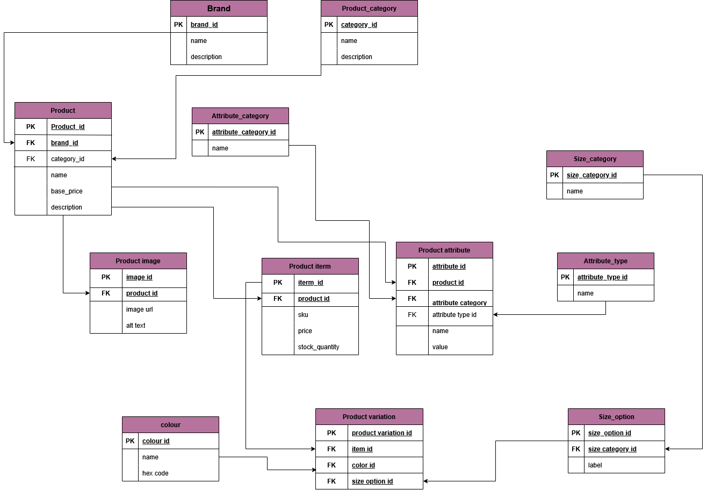

# E-Commerce Database Schema

This project defines a scalable and well-normalized **E-Commerce database schema** designed to manage products, brands, attributes, and their variations.

---

## 🚀 Features

- Supports products with multiple **variations** (color, size)
- Organized product **attributes** and **categories**
- Handles **product images**, **inventory**, and **SKUs**
- Includes **sample data** and an **ERD diagram**
- Built with **MySQL** compatibility

---

## 🧱 Database Structure

### **Main Entities**
- `brand`: Brand details
- `product`: General product info (name, brand, category, price)
- `product_item`: A sellable item (specific color/size/variation)
- `product_variation`: Maps color & size to product items
- `product_image`: Images for each product
- `color`: Color options
- `size_option` + `size_category`: Size grouping and labels
- `product_category`: Product classification
- `product_attribute`: Custom fields like material, weight, etc.
- `attribute_category` + `attribute_type`: Organize and type attributes

---

## 🖼️ ERD Diagram



---

## 🧪 Sample Data

A pre-populated sample dataset with:
- 5 Brands
- 5 Products
- Product Variations (colors & sizes)
- Attribute examples (Material, Storage, etc.)

You can find it here:
```bash
ecommerce.sql
```

## Happy coding 🌸


